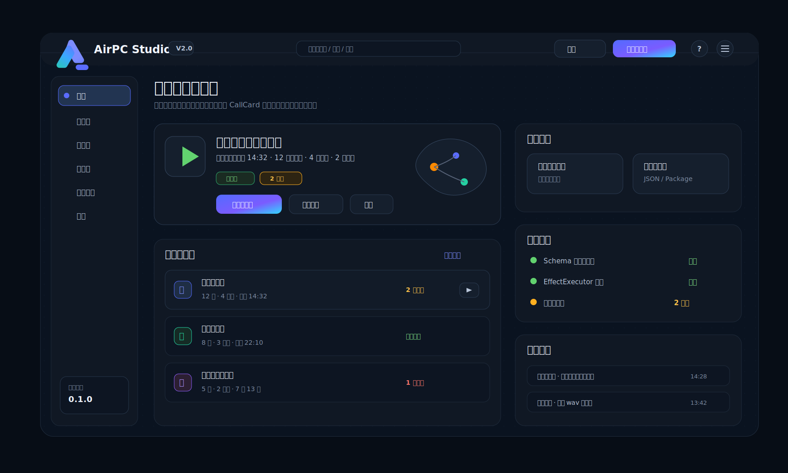

# 首页与故事包管理界面设计导向稿

> 版本定位：本文定义 Studio V2.0 首页、故事包列表、故事包详情入口的设计方向。  
> 首页不是营销页，也不是传统后台首页；它是故事工程工作台。

## 1. 首页的产品定位

Studio V2.0 打开后的第一屏，应该帮助用户快速回答四个问题：

1. 我最近在编辑哪个故事包？
2. 这个故事包现在是否健康？
3. 我下一步最可能要做什么？
4. 我能不能马上进入编辑器或调试器？

因此首页应该是「继续工作」入口，而不是宣传性 Hero，也不是堆满统计卡片的管理驾驶舱。

## 2. 首页默认布局

首页建议采用暗色工作台布局：

```text
顶部：应用标识 / 当前空间 / 搜索 / 新建 / 导入 / 设置
左侧：主导航
中部上方：最近故事包 / 继续编辑
中部下方：最近故事包列表
右侧上方：快速开始
右侧中部：工程状态
右侧下方：最近调试
```

设计稿参考：



## 3. 顶部栏

顶部栏应保持轻量，不做复杂菜单。

建议包含：

- AirPC Studio V2 logo。
- 当前工程 / 工作区名称。
- 全局搜索。
- 导入。
- 新建故事包。
- 帮助。
- 全局菜单。

全局搜索第一版可以只做入口，不要求实现复杂跨资源搜索，但视觉上要预留能力。

## 4. 左侧主导航

左侧导航用于切换顶层模块，不是故事编辑器里的角色锚点栏。

建议模块：

- 首页。
- 故事包。
- 角色库。
- 资源库。
- 调试记录。
- 设置。

要求：

- 导航项使用中文。
- 不显示内部路由名。
- 当前选中项高亮清晰。
- 不需要多级菜单。
- 不要把导航做得很宽。

## 5. 最近故事包区域

首页最重要的区域是「最近故事包」。

推荐展示：

- 故事包标题。
- 最近编辑时间。
- CallCard 数量。
- 角色数量。
- 校验状态。
- 保存状态。
- 主要操作：打开编辑器、运行调试、导出。

这个区域应允许用户一键回到最近工作现场。

不要展示：

- packageId。
- 原始 JSON 路径。
- schema 版本细节。
- 过多技术状态。

## 6. 故事包列表

首页可以展示 3-5 个最近故事包；完整列表进入「故事包」页面。

故事包列表字段建议：

- 标题。
- 描述。
- 最近编辑时间。
- 角色数。
- 卡片数。
- 资源数。
- 校验状态。
- 最近导出时间。
- 操作入口。

列表形态：

- 默认使用紧凑列表或密度适中的条目。
- 不建议使用大卡片瀑布流。
- 不建议每个故事包都放大缩略图。

故事包是工程对象，不是内容消费对象；界面要偏工作台，而不是媒体库。

## 7. 快速开始

快速开始提供最少入口：

- 新建空故事包。
- 从模板创建。
- 导入故事包。

第一版可先实现：

- 新建空故事包。
- 导入故事包。

模板能力可以留入口，但不作为第一版重点。

## 8. 工程状态

工程状态区域应展示影响创作和导出的关键状态：

- Schema 校验器是否可用。
- 当前引擎 schema 版本。
- 最近一次导出是否成功。
- 是否存在未处理错误。
- 是否存在迁移需求。

展示方式要克制，不要像监控大屏。

状态语言示例：

- 正常。
- 有警告。
- 需要处理。
- 与当前引擎不兼容。

## 9. 最近调试

最近调试用于帮助用户回到最近验证过的剧情链。

建议展示：

- 故事包名称。
- 起始卡。
- 命中出口。
- 执行结果。
- 时间。

点击后进入调试记录详情或调试器复现入口。

不要把最近调试做成 raw log 列表。

## 10. 故事包管理页

故事包管理页是首页列表的完整版本。

建议能力：

- 新建故事包。
- 导入故事包。
- 搜索故事包。
- 按状态筛选。
- 按最近编辑排序。
- 打开编辑器。
- 打开调试器。
- 导出。
- 复制故事包。
- 删除或归档故事包。

删除应有确认，归档可以作为第一版更安全的默认选择。

## 11. 故事包详情页是否需要

第一版可以不做独立故事包详情页。

原因：

- 故事包的核心工作在编辑器。
- 首页和列表已经能承担打开、调试、导出。
- 独立详情页容易变成另一个后台配置页。

如果后续需要详情页，它应该服务于版本、导出、校验报告，而不是重复编辑器能力。

## 12. 空状态

首次打开没有故事包时，首页应直接给出三个明确动作：

- 新建故事包。
- 导入故事包。
- 查看示例。

空状态文案应该短，不讲大段概念。

示例：

```text
还没有故事包
创建一个故事包，开始设计第一条 CallCard 电话链。
```

## 13. 首页验收标准

第一版至少满足：

- 打开后能看到最近故事包。
- 能一键进入故事编辑器。
- 能一键进入调试器。
- 能新建故事包。
- 能导入故事包。
- 能看到校验状态。
- 能看到最近调试。
- 不展示内部 ID 作为主要信息。
- 不把首页做成营销页。
- 不把首页做成 JSON 管理页。

## 14. 避免事项

- 不要做大 Hero。
- 不要使用浅色 SaaS 管理后台风格。
- 不要堆满统计卡片。
- 不要把故事包做成图库。
- 不要把最近调试做成日志滚动窗口。
- 不要在首页直接编辑复杂字段。
- 不要让用户在首页手填 ID。

## 15. 一句话总结

首页是「回到创作现场」的入口：最近故事包最大，快速开始最直接，工程状态只提示必要风险。

