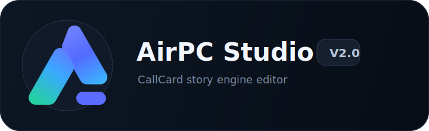

# 色板参考

> 适用范围：AirPC Studio V2 新版故事编辑器。  
> 目标气质：深色画布、蓝紫科技感、低噪声、高聚焦、适合长时间编辑复杂 CallCard 故事链。  
> 参考方向：暗色节点画布、轻量浮窗、克制高亮、剧情线与角色归属线分层。

## 1. Logo 参考

第一版 logo 参考采用「抽象 A / 节点方向感 / 蓝紫青渐变」作为核心识别，不在图标中塞入电话听筒或复杂剧情元素，避免变得琐碎。



使用建议：

- 图标用于应用左上角、启动页、导出文件标识。
- 字标使用真实文本排版，不建议把文字长期烘焙到位图里。
- 深色背景下使用彩色渐变图标。
- 极小尺寸下只使用图标，不使用完整字标。
- 不要给 logo 添加过强外发光；界面本身已经有大量连线和节点，高光要克制。

## 2. 色彩设计原则

新版 UI 的颜色应该服务于「看清故事结构」，不是服务于装饰。

基本原则：

1. 背景必须深，但不能纯黑。
2. 画布和浮窗要有层级差，不能糊成一块。
3. 角色归属线必须弱于剧情出口线。
4. 节点颜色只表达类型和状态，不做大面积装饰。
5. 蓝紫是主品牌色，但不能让整个界面变成单一蓝紫。
6. 警告、失败、成功、运行中必须有独立语义色。
7. 长时间使用时要降低高饱和色面积。

## 3. 基础暗色

| Token | 色值 | 用途 |
| --- | --- | --- |
| `bg.app` | `#070D16` | 应用最底层背景 |
| `bg.canvas` | `#0A1320` | 主画布背景 |
| `bg.canvasGrid` | `#132236` | 画布点阵 / 网格，建议 20%-35% 透明度 |
| `bg.panel` | `#101824` | 浮窗、工具栏、角色锚点栏 |
| `bg.panelElevated` | `#151F2D` | 被激活浮窗、弹出菜单 |
| `bg.node` | `#182232` | 普通节点底色 |
| `bg.nodeMuted` | `#121B28` | 弱化节点底色 |
| `bg.input` | `#0D1522` | 输入框、下拉框 |
| `bg.hover` | `#1C2A3D` | 悬停背景 |
| `bg.active` | `#223451` | 选中背景 |

建议：

- 主画布使用 `bg.canvas`，叠加很淡的点阵。
- 浮窗使用 `bg.panel`，边框和阴影建立层级。
- 节点使用 `bg.node`，选中时只强化边框，不大面积换色。

## 4. 边框与分隔

| Token | 色值 | 用途 |
| --- | --- | --- |
| `border.subtle` | `#1E2A3A` | 默认边框 |
| `border.panel` | `#26364A` | 浮窗边框 |
| `border.node` | `#354760` | 节点默认边框 |
| `border.strong` | `#536BFF` | 选中节点主边框 |
| `border.warning` | `#FFB020` | 警告边框 |
| `border.danger` | `#FF5A4E` | 失败 / 错误边框 |
| `border.success` | `#62D26F` | 成功边框 |

建议：

- 普通边框不要超过 1px。
- 选中节点可以使用 1px-2px 强边框。
- 错误状态不要整张卡变红，只标记出口、角标或边框。

## 5. 文字颜色

| Token | 色值 | 用途 |
| --- | --- | --- |
| `text.primary` | `#F2F6FF` | 主标题、关键字段 |
| `text.secondary` | `#B9C6DA` | 普通说明、节点副标题 |
| `text.muted` | `#7E8DA4` | 次级描述、弱信息 |
| `text.disabled` | `#526073` | 禁用文本 |
| `text.inverse` | `#07111D` | 高亮按钮上的深色文字 |
| `text.warning` | `#FFC24A` | 警告文字 |
| `text.danger` | `#FF776D` | 错误文字 |
| `text.success` | `#7DE086` | 成功文字 |

建议：

- 节点内文本不宜超过两级。
- 卡片标题使用 `text.primary`。
- 卡片摘要使用 `text.secondary`。
- 辅助状态使用 `text.muted`。

## 6. 品牌与操作色

| Token | 色值 | 用途 |
| --- | --- | --- |
| `brand.primary` | `#5B6CFF` | 主按钮、选中态、主品牌 |
| `brand.primaryHover` | `#6F7DFF` | 主按钮 hover |
| `brand.primaryActive` | `#4658E8` | 主按钮 active |
| `brand.violet` | `#8B5CF6` | 品牌辅助、过场播放 |
| `brand.cyan` | `#32D6FF` | 连接点、信息高亮 |
| `brand.teal` | `#25D0A2` | 世界状态、系统能力 |

主按钮建议使用蓝紫渐变：

```css
linear-gradient(135deg, #536BFF 0%, #7A5CFF 58%, #32D6FF 100%)
```

注意：

- 渐变只用于主按钮、logo、极少数激活态。
- 不要把大面积面板做成渐变。
- 不要把所有节点都做成蓝紫色。

## 7. 语义状态色

| Token | 色值 | 用途 |
| --- | --- | --- |
| `state.success` | `#62D26F` | 已保存、校验通过、执行成功 |
| `state.warning` | `#FFB020` | 警告、缺少配置、可继续但需注意 |
| `state.danger` | `#FF5A4E` | 错误、失败出口、critical effect 失败 |
| `state.info` | `#32D6FF` | 信息提示、普通调试事件 |
| `state.pending` | `#A78BFA` | 待外呼、等待执行 |
| `state.running` | `#FF8A00` | 通话中、运行中、当前焦点 |

使用建议：

- `running` 用橙色，和参考图中当前通话卡的高亮一致。
- `danger` 只用于真实失败或失败出口，不要用于普通强调。
- `pending` 用紫色，表达等待和排队。

## 8. CallCard 类型色

| 类型 | Token | 色值 | 用途 |
| --- | --- | --- | --- |
| 剧情通话 | `card.story` | `#5B6CFF` | 默认剧情卡 |
| 自由通话 | `card.free` | `#2FA86D` | 自由通话 fallback |
| 延迟外呼 | `card.scheduled` | `#FF8A00` | 延迟外呼、可提前呼入 |
| 过场播放 | `card.cutscene` | `#8B5CF6` | WAV / 过场播放 |
| 章节开始 | `card.start` | `#62D26F` | 起点节点 |
| 章节结束 | `card.end` | `#FF5A4E` | 结束节点 |
| 世界状态 | `card.world` | `#25D0A2` | 世界状态节点 |
| 动作组 | `card.action` | `#32D6FF` | 动作或系统效果 |

建议：

- 类型色主要用在左侧小条、图标、端口、边框。
- 节点主体仍然保持深色。
- 选中状态叠加 `state.running` 或 `brand.primary`，不要覆盖类型色。

## 9. 连线颜色

连线是故事编辑器的核心，需要严格分层。

| 线类型 | Token | 色值 | 默认透明度 | 规则 |
| --- | --- | --- | --- | --- |
| 角色归属线 | `line.role` | `#8A96AA` | `0.22` | 顶部端口到角色锚点，虚线，无箭头 |
| 角色归属线选中 | `line.roleActive` | `#D7E0F0` | `0.9` | 选中卡片或角色时显示 |
| 剧情流转线 | `line.flow` | `#D7E0F0` | `0.72` | 出口到下一张卡，实线，有箭头 |
| 用户主动去打 | `line.userDial` | `#7C8CFF` | `0.88` | 主动出口 |
| 角色延迟外呼 | `line.outbound` | `#FF8A00` | `0.88` | 被动出口 / 延迟外呼 |
| 失败出口线 | `line.fail` | `#FF5A4E` | `0.92` | 失败、聊崩、超时 |
| 世界状态线 | `line.world` | `#25D0A2` | `0.82` | 设置状态、更新知识 |
| 过场播放线 | `line.cutscene` | `#8B5CF6` | `0.82` | 播放过场 |
| 弱化线 | `line.muted` | `#566277` | `0.18` | 非焦点关系 |

规则：

- 角色归属线永远弱于剧情流转线。
- 失败线可以更强，但只在失败出口使用。
- 当前选中节点只高亮一跳关系。
- 非焦点线必须降透明度，避免复杂故事糊成网。

## 10. 浮窗颜色

| Token | 色值 | 用途 |
| --- | --- | --- |
| `window.bg` | `#101824` | 浮窗底色 |
| `window.bgActive` | `#151F2D` | 激活浮窗 |
| `window.header` | `#121C2A` | 浮窗标题区 |
| `window.border` | `#2A3A50` | 浮窗边框 |
| `window.shadow` | `rgba(0, 0, 0, 0.36)` | 浮窗阴影 |
| `window.overlay` | `rgba(7, 13, 22, 0.62)` | 模态遮罩 |

建议：

- 浮窗圆角 8px。
- 节点圆角 8px。
- 工具栏圆角 10px-12px。
- 不使用大圆角胶囊风格，避免显得像移动端组件。

## 11. 角色锚点颜色

| Token | 色值 | 用途 |
| --- | --- | --- |
| `anchor.bg` | `#101824` | 锚点栏背景 |
| `anchor.itemBg` | `#121B28` | 角色项背景 |
| `anchor.itemHover` | `#18263A` | 角色项 hover |
| `anchor.itemActive` | `#1F2E45` | 角色项选中 |
| `anchor.borderActive` | `#FF8A00` | 当前通话 / 当前选中角色 |
| `anchor.dotFree` | `#62D26F` | 空闲 |
| `anchor.dotCalling` | `#FF8A00` | 通话中 |
| `anchor.dotPending` | `#A78BFA` | 待外呼 |
| `anchor.dotLocked` | `#FF5A4E` | 锁定 / 异常 |

角色锚点栏应像导航和锚点，不像后台列表。

## 12. 控件颜色

| 控件 | 默认 | Hover | Active |
| --- | --- | --- | --- |
| 主按钮 | `#5B6CFF` | `#6F7DFF` | `#4658E8` |
| 次按钮 | `#151F2D` | `#1C2A3D` | `#223451` |
| 危险按钮 | `#C8453D` | `#E55349` | `#A93731` |
| 输入框 | `#0D1522` | `#111C2C` | `#101824` |
| 下拉框 | `#0D1522` | `#111C2C` | `#151F2D` |
| 端口点 | `#9BA8BA` | `#D7E0F0` | `#FF8A00` |

控件文本和图标必须满足可读性，不能为了暗色质感牺牲识别度。

## 13. CSS 变量建议

```css
:root {
  --bg-app: #070D16;
  --bg-canvas: #0A1320;
  --bg-panel: #101824;
  --bg-panel-elevated: #151F2D;
  --bg-node: #182232;

  --border-subtle: #1E2A3A;
  --border-panel: #26364A;
  --border-node: #354760;
  --border-strong: #536BFF;

  --text-primary: #F2F6FF;
  --text-secondary: #B9C6DA;
  --text-muted: #7E8DA4;

  --brand-primary: #5B6CFF;
  --brand-violet: #8B5CF6;
  --brand-cyan: #32D6FF;
  --brand-teal: #25D0A2;

  --state-success: #62D26F;
  --state-warning: #FFB020;
  --state-danger: #FF5A4E;
  --state-running: #FF8A00;
  --state-pending: #A78BFA;

  --line-role: rgba(138, 150, 170, 0.22);
  --line-role-active: rgba(215, 224, 240, 0.9);
  --line-flow: rgba(215, 224, 240, 0.72);
  --line-user-dial: rgba(124, 140, 255, 0.88);
  --line-outbound: rgba(255, 138, 0, 0.88);
  --line-fail: rgba(255, 90, 78, 0.92);
  --line-world: rgba(37, 208, 162, 0.82);
}
```

## 14. 禁止事项

第一版执行时应避免：

- 纯黑背景。
- 大面积蓝紫渐变背景。
- 所有节点都用同一种蓝色。
- 高饱和边框到处发光。
- 角色归属线过亮。
- 失败色用于普通强调。
- 透明浮窗导致文字压在线条上。
- 卡片中堆太多颜色标签。
- 暗色背景上使用低对比灰字。
- 把 logo 做得过于复杂，导致小尺寸不可识别。

## 15. 一句话总结

这套色板的方向是「深色画布承载复杂结构，蓝紫品牌色负责识别，橙红绿青负责状态语义，所有高亮都为编辑焦点服务」。
